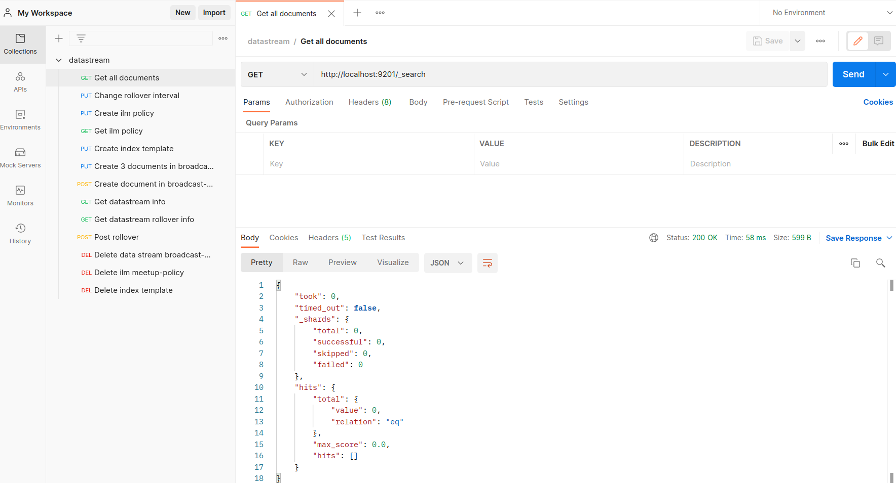

# datastream
You can find the presentation pdf [here](src/datastream_ES_Meetup.pdf)

## Installation

The project installation is done with a Makefile. To be able to fully use the Makefile, you will need to have theses packages installed:
* docker
* docker-compose

Then you can run `make up`.

## How to use the project

You can access the elastic cluster in

http://localhost:9201

To easily access the endpoints you can import the datastream_collection.json file in the postman directory into postman.

See [datastream_collection.json](postman/datastream_collection.json).

After importing you must have this collection in postman :

Now you can access all the endpoints of the collection

If you don't have postman, you can use the curl request in the bash directory

See [datastream_curl.sh](bash/datastream_curl.sh).
